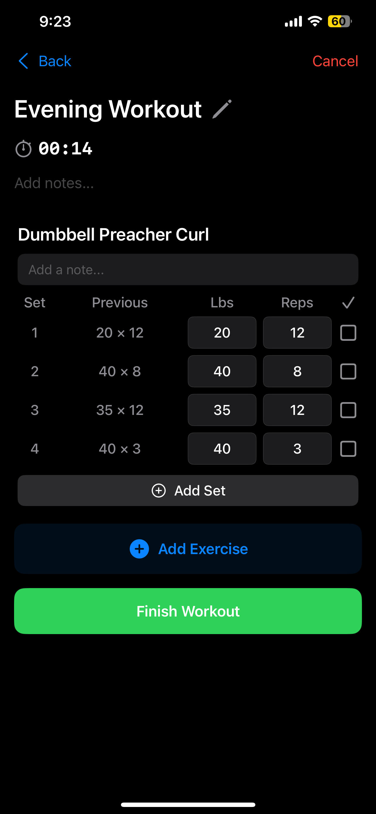
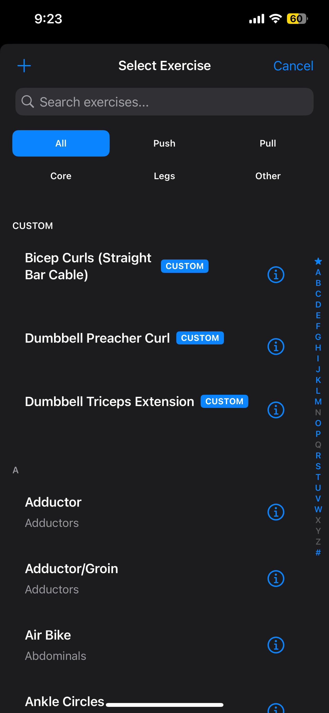
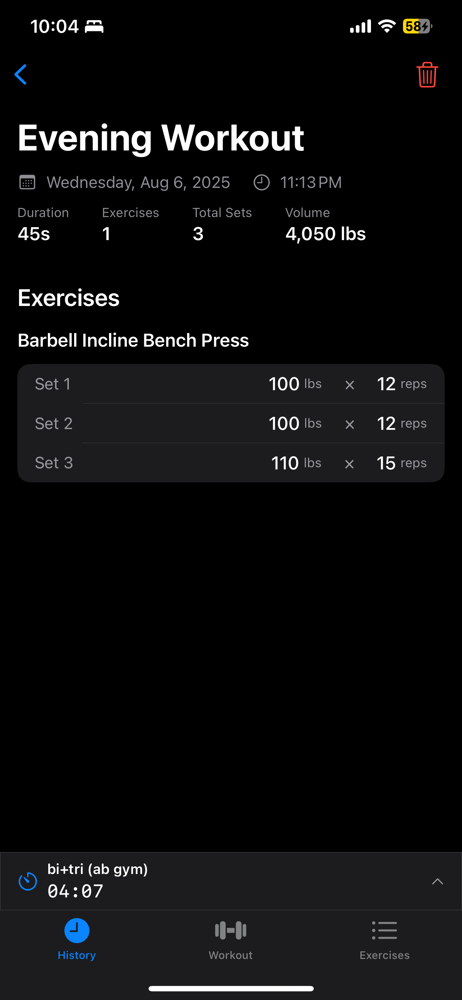
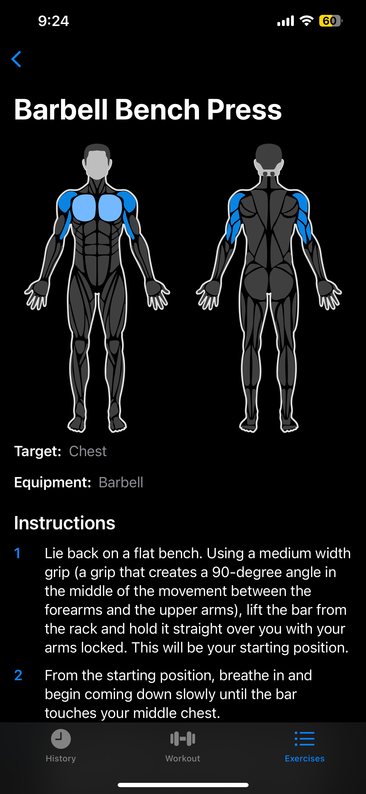
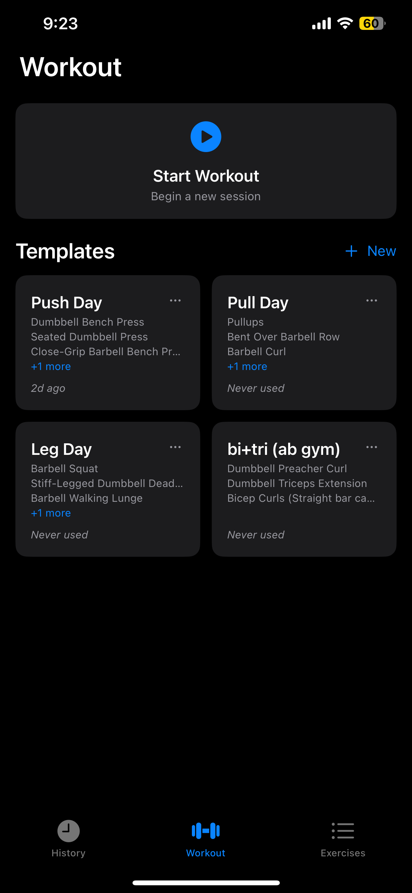
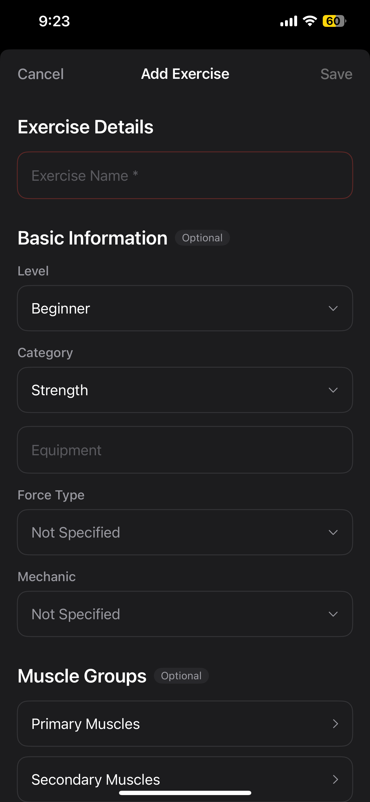

# Curls App

A privacy-first iOS workout loggin app. An watchOS integration coming soon.

Testflight link: https://testflight.apple.com/join/mAfE5kJD

## 📱 Screenshots

| Workout Session | Exercise Database | History |
|-----------------|-------------------|---------|
|  |  |  |

| Body Diagram | Templates | Custom Exercise |
|--------------|-----------|-----------------|
|  |  |  |

## 🎯 Philosophy

Built on the principle that fitness tracking should be simple, beautiful, and private. No accounts, no cloud syncing, no analytics tracking - just you and your workouts. All data stays on your device, giving you complete control over your fitness journey.

## ✨ Features

### Core Workout Tracking
- **Active Workout Sessions**: Real-time workout tracking with persistent timer that continues even when app is minimized
- **Smart Set Management**: Track weight, reps, and rest periods with intelligent prefilling based on workout history
- **Custom Number Pad**: Calculator-style input optimized for gym use - no more fighting with the keyboard
- **Exercise Reordering**: Drag-and-drop to reorganize exercises during your workout
- **Note Taking**: Add notes to individual exercises or entire workouts
- **Rest Timer**: Built-in rest timer between sets with haptic feedback

### Exercise Database
- **800+ Exercises**: Comprehensive database covering all major movement patterns
- **Custom Exercises**: Create and save your own exercises with full categorization
- **Interactive Body Diagrams**: Visual muscle group selection using WebKit-rendered SVG diagrams
- **Advanced Filtering**: Search by name, muscle groups, equipment, or difficulty level
- **Smart Categorization**: Push/Pull/Legs/Core/Other grouping for easy navigation
- **Alphabetic Index**: Quick navigation through large exercise lists

### Workout History & Analytics
- **Complete Workout Logging**: Every set, rep, and weight tracked with timestamps
- **Progress Tracking**: View historical performance for any exercise
- **Volume Analytics**: Automatic calculation of total volume and workout duration
- **Smart Date Formatting**: Intuitive display (Today, Yesterday, This Week, or full date)
- **Detailed Review**: Post-workout analysis with set-by-set breakdown

### Template System
- **Save Workouts as Templates**: Turn successful workouts into reusable routines
- **Template Management**: Full create, read, update, and delete operations
- **Smart Validation**: Automatic template integrity checking and repair
- **Usage Tracking**: See when templates were last used
- **Quick Start**: Launch workouts from templates with prefilled data

### Privacy & Data
- **100% Offline**: No internet connection required, ever
- **Local Storage Only**: All data stored on your device using iOS FileManager
- **No Analytics**: Zero tracking, no telemetry, no data collection
- **No Accounts**: No sign-up, no login, just open and start tracking
- **Export Ready**: JSON-based storage format for easy data portability


## 🛠 Technical Specifications

- **Platform**: iOS 18.5+
- **Framework**: SwiftUI (100% native)
- **Language**: Swift 5.0+
- **Architecture**: Feature-based modular architecture
- **Dependencies**: Zero - pure iOS SDK only
- **Device Support**: iPhone only (optimized for one-handed use)
- **Xcode**: Latest version recommended

## 📦 Installation

### Prerequisites
- macOS with Xcode installed
- iOS device or simulator running iOS 18.5+

### Clone the Repository

```bash
# Clone with exercise database submodule
git clone --recursive https://github.com/randomlylelo/curlsapp.git
cd curlsapp

# Or if already cloned without submodules
git submodule update --init --recursive
```

### Build and Run

1. Open `curlsapp.xcodeproj` in Xcode
2. Select your target device or simulator (iPhone 16 recommended)
3. Press `Cmd+R` to build and run

### Command Line Build

```bash
# Build the project
xcodebuild build -project curlsapp.xcodeproj -scheme curlsapp -destination 'platform=iOS Simulator,name=iPhone 16'

# Run tests
xcodebuild test -project curlsapp.xcodeproj -scheme curlsapp -destination 'platform=iOS Simulator,name=iPhone 16'
```

## 🏗 Architecture

The app follows a feature-based architecture with clean separation of concerns:

```
curlsapp/
├── App/                    # Application entry and navigation
├── Features/               # Feature modules
│   ├── ExerciseDatabase/   # Exercise browsing and management
│   ├── Session/            # Active workout tracking
│   ├── History/            # Workout history and analytics
│   └── Templates/          # Workout template system
├── Shared/                 # Shared components and utilities
│   ├── Models/             # Data models
│   ├── Services/           # Business logic services
│   ├── Components/         # Reusable UI components
│   └── Extensions/         # Swift extensions
└── Resources/              # Assets and data files
```

### Key Design Patterns
- **Observable**: Modern SwiftUI state management with @Observable
- **Service Layer**: Clean separation of business logic from UI
- **Singleton**: WorkoutManager for global workout state
- **Repository**: Storage services for data persistence

For detailed architecture documentation, see [CLAUDE.md](CLAUDE.md).

## 🧪 Testing

The project includes both unit and UI tests:

```bash
# Run all tests
xcodebuild test -project curlsapp.xcodeproj -scheme curlsapp -destination 'platform=iOS Simulator,name=iPhone 16'

# Run with verbose output
xcodebuild test -project curlsapp.xcodeproj -scheme curlsapp -destination 'platform=iOS Simulator,name=iPhone 16' -verbose
```

## 🔧 Development

### Project Configuration
- **Bundle ID**: curls.curlsapp
- **Version**: 1.0
- **Build**: Auto-incremented
- **Team ID**: G4P8PVAJ4A

### Code Style
- SwiftUI best practices with @Observable for state management
- Feature-based modular architecture
- Minimal external dependencies (currently zero)
- Comprehensive documentation in code

### Building for Release

```bash
# Archive for App Store
xcodebuild archive -project curlsapp.xcodeproj -scheme curlsapp -archivePath ./build/curlsapp.xcarchive

# Export IPA
xcodebuild -exportArchive -archivePath ./build/curlsapp.xcarchive -exportPath ./build -exportOptionsPlist ExportOptions.plist
```

## 📊 Data Storage

### Workout Data
- **Location**: `Documents/Workouts/` directory
- **Format**: JSON files with ISO8601 date stamps
- **Structure**: Hierarchical (Workout → Exercises → Sets)

### Templates
- **Location**: UserDefaults
- **Format**: Codable Swift structures
- **Validation**: Automatic integrity checking

### Custom Exercises
- **Location**: `Documents/` directory
- **File**: `custom_exercises.json`
- **Merge**: Combined with database exercises at runtime

## 🚀 App Store

The app is ready for App Store submission with:
- Complete app icon set (1024x1024 EZ bar design)
- 6 App Store screenshots
- Privacy policy emphasizing local-first approach
- App Store description and keywords
- No third-party dependencies requiring disclosure

## 📄 License

This project is licensed under the GNU General Public License v3.0 - see the [LICENSE](LICENSE) file for details.

**Note**: The exercise database (`free-exercise-db` submodule) is separately licensed under MIT for maximum reusability.

## 🤝 Contributing

We welcome contributions! Please see [CONTRIBUTING.md](CONTRIBUTING.md) for guidelines.

### Development Setup
1. Fork the repository
2. Create a feature branch (`git checkout -b feature/amazing-feature`)
3. Commit your changes (`git commit -m 'Add amazing feature'`)
4. Push to the branch (`git push origin feature/amazing-feature`)
5. Open a Pull Request

## 🙏 Acknowledgments

- **Exercise Database**: Forked from [free-exercise-db](https://github.com/yuhonas/free-exercise-db) (License: Unlicense)
- **Body Diagram**: Converted from [react-native-body-highlighter](https://github.com/HichamELBSI/react-native-body-highlighter) with help of Claude Code.
- **Design Philosophy**: Inspired by Steve Jobs' principle of simplicity
- **Icons**: Custom designed EZ bar app icon (using Claude Code + SVG)
- **Community**: Thanks to all contributors and users

## 📞 Support

- **Bug Reports**: [GitHub Issues](https://github.com/randomlylelo/curlsapp/issues)
- **Feature Requests**: [GitHub Discussions](https://github.com/randomlylelo/curlsapp/discussions)
- **Documentation**: [Wiki](https://github.com/randomlylelo/curlsapp/wiki)

---

<p align="center">
Made with ❤️ for the community<br>
Simple. Beautiful. Private.
</p>
